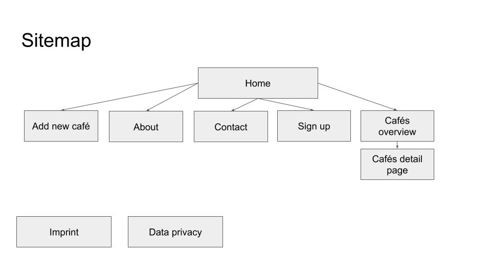

# Work from anywhere landingpage 

WS2019- ID_19 — Responsive Design - Assessment Submission by Lukas Menzel

## Assets
- **Figma File (Handed in via Google Form)**
- **GitHub repo containing the source files**
- **README file containing the documentation**
- **Live Version: https://lukas-menzel.github.io/work-from-anywhere/**

## About the project
WORK FROM ANYWHERE is website where travellers, freelancer and people who like to work in cafés can find cafès nearby to work. The services displays therefore different cafés at the current location of the user and shows all important information about the cafés (e.g. Wifi, power supply, price) to enable the find the right café to work from. 

This repository includes the implemented version of the landingpage in HTML and CSS. All functionalities and sub-sites are missing. 

## Process
To create the landingpage for WORK FROM ANYWHERE I started with research about competitors in the market and creating a concept. After that I created first wireframes in figma and based on that a screendesign for mobile, tablet and desktop devices in figma. For that I asked two potential users to give me feedback for the design to iterate on it. After that I implemented the project in HTML and CSS. 

### concept
In the beginning I created a short concept of the website. I decided for the following of the main navigation: 
- Home
- Add new Cafés
- About
- Contact
- Signup

In addition to that I created the following sitemap. 

Befor starting designing I also researched and reviewed several competitors (workfrom.co, anyworkanywhere.com, nomadlist.com) to see how WORK FROM ANYWHERE can differentiate itself. 

### Wireframing
For the wireframing I used figma and a wireframing template. This enabled me to quickly sketch a first draft of WORK FROM ANYWHERE. The wireframes are created as a desktop design since it is easier to design for desktop devices and has less boundaries. 

### Screendesign
For the screendesign I also used figma, but started from creating first a mobile design and than the desktop and tablet version. I used a 4 column grid for the mobile design and a 12 column grid for the desktop design. Since I never created a detailed design in figma. To make the whole design consistent I created reusable components for the most common elements (e.g. buttons). 

### Implementation in HTML and CSS
As the first version landingpage shouldn't inclued any logic and to focus more on learning I decided to develop the website without any JavaScript framework and didn't consider any backend functionalities. 
 
Since I was already familiar with basic HTML and CSS concepts I wanted to go one step further and try out ne techniques. Therefore I used SASS as a precomipiler for CSS. Esspecially for larger projects SASS makes it easier to structure a project and enables a more advanced syntax. For structuring the files I used the 7-1 Pattern and imported in the beginning of the project a 7-1 Pattern template (https://gist.github.com/rveitch/84cea9650092119527bc). Since I didn't use any vendors and themes I deleted the folders and files which weren't needed for my project. 

To have a consistent naming structure in CSS I followed the BEM scheme. 

While I already had some experience with basic CSS layout systems and Flexbox I wanted to try out the implementation of CSS as it enables named as the most powerefull layout system in CSS. I decided to define two breakpoints (at 768px and 1024px) since I have a basic design so that it is sufficient to only have to breakpoints for mobile and the tablet version. 

To test the website locally I used Node.JS, created a server.js and used a SASS watcher to compile css. 

Since the website is static I deployed it on Github pages. I also minified the production css files to optimize the website performance. 

## Reflection 
I wanted to use this project not only to showcase my knowledge in responsive design, but also to extend my knowledge in this field. Therefore I learned how to use SASS, the 7-1 pattern and BEM naming structure. In addition I also used for the first time from skretch CSS Grid and read a lot about the concept and the implementation of it. It was awesome to see the advantages and how easy CSS Grid can be implemented if you follow the guideline. 

Besides this project I also created several websites and layouts using Flexbox and basic CSS layout-techniques since I was the frontend developer in my team where we used React.Js to build our frontend application. This also helped me to improve my knowledge in CSS and enabled me to quickly build new websites and layouts using HTML and CSS. 
